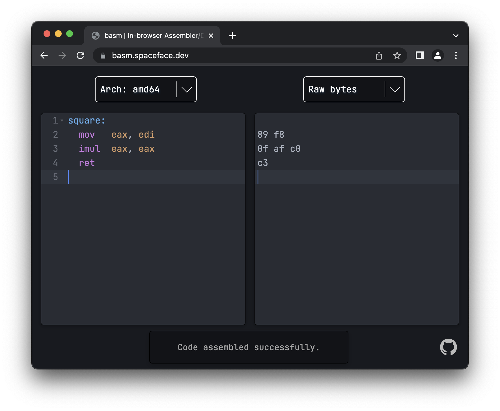

# basm

An in-browser assembler / disassembler. Use the left editor to write assembly code to view the machine code on the right,
and edit the machine code to see the corresponding disassembly.

Live version available at https://basm.spaceface.dev.

basm uses LLVM's [keystone](https://www.keystone-engine.org/) and [capstone](http://www.capstone-engine.org/) libraries,
which are compiled to WebAssembly so they can run locally inside the browser (even when offline).
It currently supports x86, ARM, and MIPS (both 32-bit and 64-bit variants), and other architectures can also be included in the future.

Inspired by [disasm.pro](https://github.com/ret2jazzy/disasm.pro).
